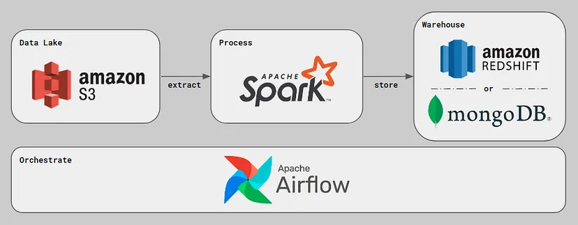

# Relatório de Estudos

**Nome do Estagiário:** Gabriel Silva Brizola
**Data:** 09/08/2024

**Módulos/Etapas Feitas:**   
1.[**Analítico**](#analitico)  
2.[**Apache Spark**](#spark)   
3.[**Apache Hadoop**](#hadoop)     
4.[**Apache Hive**](#hive)   
5.[**Python**](#python)   
6.[**Apache Beam**](#beam)    
7.[**Big Query**](#bigquery)     
8.[**Google Dataflow**](#dataflow)   
9.[**Apache Airflow**](#airflow)    

## Resumo dos módulos 

### Analítico <a id = "analitico"></a>
Bases analíticas são tecnologias que busca facilitar a análise de grandes quantidades de dados, otimizando as execuções de consultas complexas e operações de análise dos dados deixando mais rápido o processo. também é possível a integração de diversas fontes de dados, podendo ser dados estruturados, semiestruturados ou não estruturados.

Exemplos de Tecnologias de Bases Analíticas: OLAP (Online Analytical Processing), Apache Spark, Google BigQuery, Amazon Redshift, Microsoft Azure Synapse Analytics

### Apache Spark <a id = "spark"> </a>
Apache Spark é um framework de código aberto de análise unificado para o processamento de grandes volumes de dados. O maior benefício do apache spark é o carregamento das informações que estão dentro do disco do computador diretamente para a memória, assim aumentando sua velocidade. ele divide os dados em partições e distribui essas partições entre os diferentes nós do cluster(agrupamento de computadores), também um grande benefício do cluster é que se um computador tiver algum problema de hardware ou software e parar a operação, outro computador que faça parte do cluster e possui uma cópia continua a operação.

Workloads do Apache Spark: SQL, Streaming(análises em tempo real), MLlib(machine learning) e GraphX(processamento de gráficos).


### Apache Hadoop <a id = "hadoop"> </a>
O Apache Hadoop é um framework de código aberto que gerencia o processamento e o armazenamento de grandes volumes de dados usando modelos de programação simples e utilizando clusters, alguns dos principais benefícios do Hadoop são escalabilidade(escalonamento horizontalmente) e flexibilidade(Dados estruturados e não estruturados).


### Apache Hive <a id = "hive"> </a>
Apache hive é um framework de código aberto com funções de armazenagem de dados data warehouse, ele permite o resumo dos dados, consulta e análise dos dados, oferecendo uma interface baseado em SQL, que associa aos dados HDFS (Hadoop Distributed File System) com esquemas mais estruturados.

**Ferramentas principais:** MapReduce(Processamento distribuído) e HDFS(Hadoop Distributed File System).
No MapReduce ocorre toda a parte do processamento dos dados e no HDFS é toda a parte de armazenamento dos dados.

### Python <a id = "python"></a>
Python é uma linguagem de programação de alto nível normalmente utilizada em Desenvolvimento Web, Data Science e Machine Learning.

**Os maiores benefícios da linguagem Python são:** Possui diversas bibliotecas e frameworks para quase todas as ocasiões, grande comunidade ativa de desenvolvedores python, é possível a portabilidade do Python em diferentes sistemas operacionais.

### Apache Beam <a id = "beam"></a>
O Apache Beam é um modelo de programação de código aberto para pipelines de processamento de dados unificada em batch(lote) e streaming(tempo real), ele ajuda com o processamento de dados em grandes volumes.

Principais Características do Apache Beam: Modelo de programação unificado(batch ou streaming), Portabilidade(pode ser executado em diversos mecanismos: Apache Flink, Apache Samza, Google Cloud Dataflow), Suporte para várias linguagens de programação(Java, Python e Go.), Windowing(janelas que dividem um fluxo contínuo de dados em blocos de tempo) e Watermarks(indicadores de tempo que ajudam o sistema).


### Big Query <a id = "bigquery"></a>
O Big Query é um data warehouse que ajuda a gerenciar e analisar os dados com todos os recursos integrados com os outros produtos do GCP(Google Cloud Platform), nele é permitido a linguagem SQL para as consultas, sendo rápidas e eficientes para grandes quantidades de dados.


### Google Dataflow <a id = "dataflow"></a>
O Dataflow é um serviço do GCP(Google Cloud Platform) para pipelines que fornece processamento unificado de dados de streaming(tempo real) e em batch(lote) para um grande volume de dados.

Principais vantagens do Dataflow: Gerenciado(Google gerencia todos os recursos necessários), Escalonável(grande volume de dados), Portabilidade(pode ser executado em diversos mecanismos: Apache Flink ou Apache Spark), Flexível(compatível com várias maneiras diferentes de criar e executar pipelines).


### Apache Airflow <a id = "airflow"></a>
O Apache Airflow é uma ferramenta de orquestração de fluxo de trabalho de código aberto tem sido mais utilizada na engenharia de dados para gerenciar os fluxos de ETL(Extração, Transformação e Carregar), nele é possível definir, programar e monitorar os fluxos de trabalho, chamados DAGs(Directed Acyclic Graphs), assim podendo lidar com dependências entre tarefas e para gerenciar falhas, tendo mecanismos de novas tentativas e notificações de alerta.

Principais vantagens do Apache Airflow: Flexibilidade, Escalabilidade, Monitoramento e Notificação, Interface Web.

**Componentes Principais:**    
1.**DAGs(Directed Acyclic Graph):** Fluxo de tarefas.      
2.**Operadores:** Componentes que definem as ações que serão executadas em cada tarefa.   
3.**Tasks:** Unidade de trabalho dentro de uma DAG, uma ação específica.     
4.**Scheduler:** Responsável por acionar as tarefas baseadas no cronograma definido.   
5.**Executor:** Responsável em realmente executar as tarefas. Pode utilizar backends, como Celery, Kubernetes ou LocalExecutor.  
6.**Interface Web:** Interface gráfica para visualizar as DAGs e as gerenciar.




## Links de Laboratórios

- [https://www.cloudskillsboost.google/paths/18/course_templates/578/labs/449087?locale=pt_BR](https://www.cloudskillsboost.google/paths/18/course_templates/578/labs/449087?locale=pt_BR)
- [https://www.cloudskillsboost.google/course_templates/623/labs/464851](https://www.cloudskillsboost.google/course_templates/623/labs/464851)
- [https://www.cloudskillsboost.google/course_templates/218/labs/496922](https://www.cloudskillsboost.google/course_templates/218/labs/496922)
- [Badge: Serverless Data Processing with Dataflow: Foundations](https://www.cloudskillsboost.google/public_profiles/a327db39-0839-45f9-8d75-350a5521e512/badges/10506979)

**Recursos Utilizados:**  
- [https://cloud.google.com/learn/what-is-apache-spark?hl=pt-BR](https://cloud.google.com/learn/what-is-apache-spark?hl=pt-BR)
- [https://www.youtube.com/watch?v=aTIhh515aKM](https://www.youtube.com/watch?v=aTIhh515aKM)
- [https://www.youtube.com/watch?v=nVI4xEH7yU8](https://www.youtube.com/watch?v=nVI4xEH7yU8)
- [https://cloud.google.com/learn/what-is-hadoop?hl=pt-BR](https://cloud.google.com/learn/what-is-hadoop?hl=pt-BR)
- [https://aws.amazon.com/pt/what-is/python/](https://aws.amazon.com/pt/what-is/python/)
- [https://www.youtube.com/watch?v=VfpXMuwbQXc&list=PLjwVjYMyoFoFO-TvZuxmqe5nlfr8xG5lk](https://www.youtube.com/watch?v=VfpXMuwbQXc&list=PLjwVjYMyoFoFO-TvZuxmqe5nlfr8xG5lk)
- [https://www.udemy.com/course/spark-curso-completo/learn/lecture/28198834#overview](https://www.udemy.com/course/spark-curso-completo/learn/lecture/28198834#overview)
-[https://www.alura.com.br/artigos/join-e-seus-tipos](https://www.alura.com.br/artigos/join-e-seus-tipos)
-[https://beam.apache.org/about/](https://beam.apache.org/about/)
-[https://cloud.google.com/dataflow/docs/overview?hl=pt-br](https://cloud.google.com/dataflow/docs/overview?hl=pt-br)


**Principais comandos:**  
```python
df = spark.read.csv("caminho/do/arquivo.csv", header=True, inferSchema=True) # ler um arquivo csv
```
```python
df = spark.read.parquet("caminho/do/arquivo.parquet") # Ler um arquivo Parquet
```
```python
df = spark.read.json("caminho/do/arquivo.json") # Ler um arquivo JSON
```
```python
df.write.tipodoarquivo("caminho/do/saida.parquet") # Escrever um DataFrame
```
```python
df.show() # Mostrar as primeiras linhas do DataFrame
```
```python
df.select("coluna1", "coluna2").show() # Selecionar colunas
```
```python
df.filter(df["coluna"] > valor).show() # Filtro
```
```python
df.groupBy("coluna").count().show() # Agrupar por uma coluna e contar
```
```python
df2 = df.join(outro_df, df["coluna"] == outro_df["coluna"]) # Juntar DataFrames
```
```sql
SELECT * FROM nome_da_tabela; -- Selecionar dados de uma tabela
```
```sql
SELECT * FROM nome_da_tabela WHERE coluna2 > 10; -- Filtrar resultados
```
```sql
SELECT coluna1, COUNT(*) FROM nome_da_tabela GROUP BY coluna1; -- Agrupa os dados pela coluna 1 e conta quantos registros há em cada grupo
```
```sql
SELECT * FROM nome_da_tabela ORDER BY coluna2 DESC; -- Ordenar resultados
```
```sql
SELECT tabela_1.coluna1, tabela_2.coluna2
FROM tabela_1
JOIN tabela_2 ON tabela_1.coluna_pk = tabela_2.coluna_fk; -- INNER JOIN
```
```sql
SELECT tabela_1.coluna1 FROM tabela_1 FULL JOIN tabela_2 ON tabela_1.coluna_pk = tabela_2.coluna_fk -- FULL JOIN
```
```sql
SELECT tabela_1.coluna1 FROM tabela_1 CROSS JOIN tabela_2 -- CROSS JOIN
```


**Desafios Encontrados:**  
Meu desafio foi o curso recomendado de Hive estar em inglês, não possuindo legenda em português, dificuldade com as tecnologias da trilha.

**Feedback e Ajustes:**  
Mais recomendações de cursos para estudo.

**Próximos Passos:**  
Aprender melhor sobre as tecnologias utilizadas.