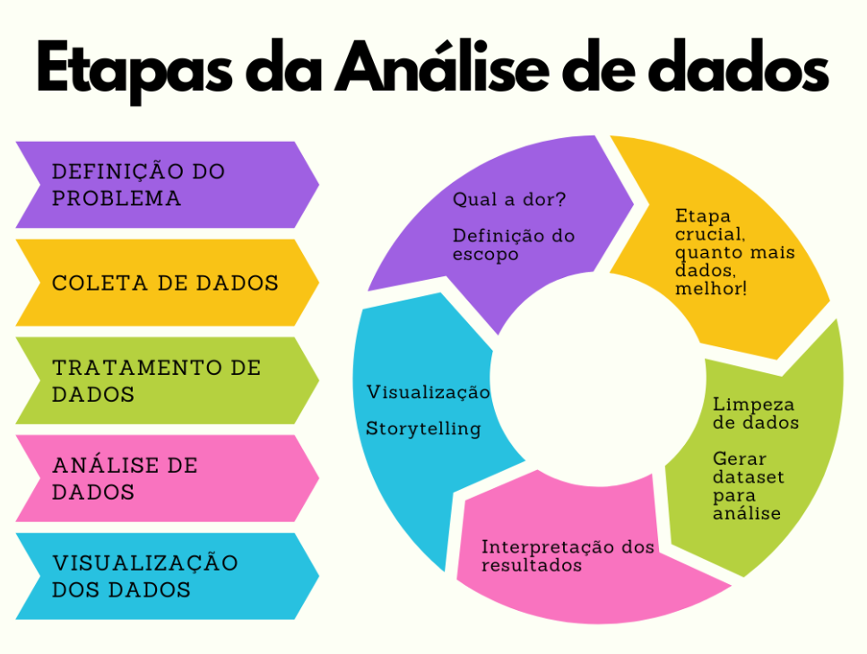
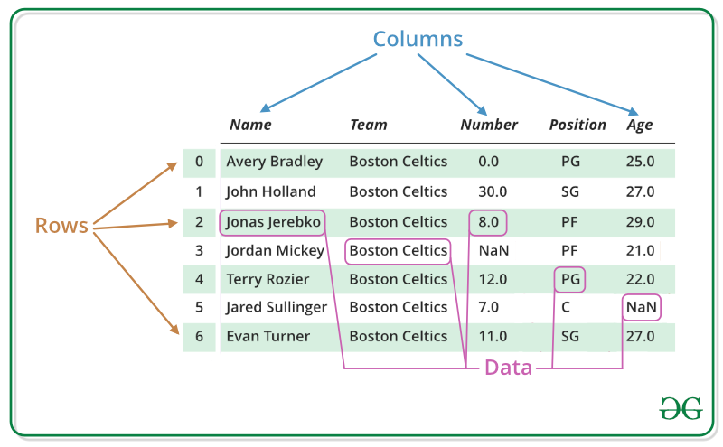
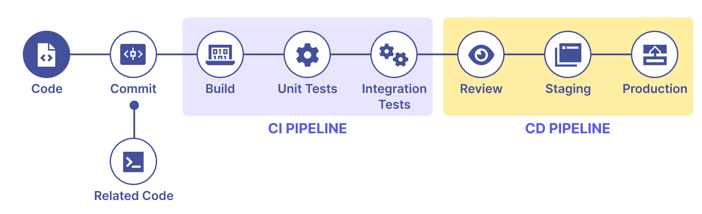
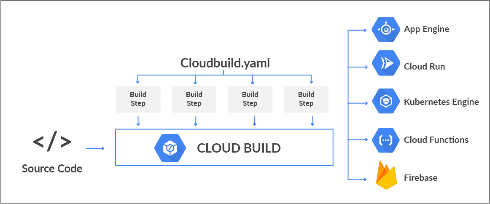

# Relatório de Estudos

**Nome do Estagiário:** Gabriel Silva Brizola        
**Data:** 20/08/2024

**Módulos/Etapas Feitas:**  
1. **[Análise de dados](#dados)**
2. **[Biblioteca Pandas](#pandas)**
3. **[CI/CD](#cicd)**
4. **[Cloud Build](#build)**

## Resumo dos módulos 

### Análise de dados <a id = "dados"></a>
Análise de dados é a inspeção, limpeza e a apresentação dos resultados dos dados, de modo que, esse dado seja transformado em algo que pode ser facilmente visualizado em informações importantes. Para melhor atender uma análise de dados, existem 4 tipos que pode ser utilizado.

### Tipos de análise de dados
- **Análise descritiva**: Tem como objetivo entender e descrever eventos passados e presentes.
- **Análise preditiva**: Tem como objetivo prever tendências e resultados futuros utilizando dados históricos.
- **Análise prescritiva**: Tem como objetivo dar recomendações sobre ações a serem tomadas para alcançar um objetivo.
- **Análise diagnóstica**: Tem como objetivo explorar os dados para entender causas passadas.



### Pandas <a id = "pandas"></a>
Pandas é uma das mais famosas bibliotecas para a manipulação e análise de dados, construída sobre Python, tem como objetivo ter uma abordagem rápida e flexível, com grande volume de dados para ser trabalhado, as estruturas que pandas utiliza é Series(unidimensional) e DataFrame(bidimensional).



### CI/CD <a id = "cicd"></a>
- **CI(Continuous Integration) ou Integração Contínua**: É a prática de integrar mudanças a um repositório de forma automatizada, ele automaticamente é testado para identificar erros e garantir que ele funcione corretamente.
- **CD(Continuous Delivery e Continuous Deployment) ou Entrega Contínua e Implantação Contínua**: Dentro do CD existem duas etapas, a primeira sendo Continuous Delivery que pega o código testado pela etapa CI e passa novamente por testes automatizados e são empacotados para ser lançado em produção, após isso vem o Continuous Deployment que lança as atualizações no ambiente de produção.



### Cloud Build <a id = "build"></a>
O Cloud Build é um serviço do GCP(Google Cloud Plataform) que executa seus builds no Google Cloud, ele pode importar o código de diversos repositórios como GitLab, GitHub e Bitbucket, e também em espaços do Cloud Storage. Basicamente o cloud build é a ferramenta de CI/CD do GCP.



**Recursos Utilizados:**  
- [https://www.alura.com.br/empresas/artigos/analise-de-dados?srsltid=AfmBOopOuDDfsWvSRmdSvGbR-lo4-bP6MMnoJXR7AdpVULlzXBz6T8XM](https://www.alura.com.br/empresas/artigos/analise-de-dados?srsltid=AfmBOopOuDDfsWvSRmdSvGbR-lo4-bP6MMnoJXR7AdpVULlzXBz6T8XM)
- [https://pandas.pydata.org/docs/user_guide/index.html](https://pandas.pydata.org/docs/user_guide/index.html)
- [https://www.redhat.com/pt-br/topics/devops/what-is-ci-cd](https://www.redhat.com/pt-br/topics/devops/what-is-ci-cd)
- [https://cloud.google.com/build/docs?hl=pt-br](https://cloud.google.com/build/docs?hl=pt-br)


**Principais comandos:**  
```python
import pandas as pd # Importando a biblioteca pandas
```
```python
data = {'Nome': ['Ana', 'João', 'Maria'], 'Idade': [23, 25, 22]} # Titulos das colunas e seus valores
df = pd.DataFrame(data) # Criação do DataFrame
```
```python
df = pd.read_csv('dados.csv') # Leitura de arquivo csv
```
```python
df.head() # Exibe as primeiras 5 linhas
```
```python
df.tail() # Exibe as últimas 5 linhas
```
```python
df.info() # Exibe informações gerais do DataFrame
```
```python
df.describe() # Descrição estatística das colunas numéricas
```
```python
df_sorted = df.sort_values('Idade') # Ordena pela coluna idade
```

**Desafios Encontrados:**  
Falta de cursos para estudo.

**Feedback e Ajustes:**  
Ter partes práticas sobre as tecnologias abordadas.

**Próximos Passos:**  
Estudar mais sobre os assuntos anteriormente abordados com práticas.